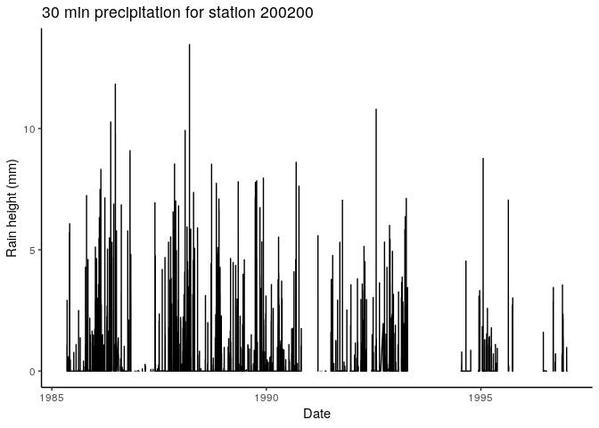

hydroscoper
================

<!-- README.md is generated from README.Rmd. Please edit that file -->

[](https://travis-ci.org/kvantas/hydroscoper)
[](https://ci.appveyor.com/project/kvantas/hydroscoper)
[](https://codecov.io/gh/kvantas/hydroscoper)
[](https://cran.r-project.org/)
[](https://cran.r-project.org/package=hydroscoper)
[](https://github.com/kvantas/hydroscoper)
[](http://cran.rstudio.com/web/packages/hydroscoper/index.html)
[](https://github.com/ropensci/onboarding/issues/185)
[](https://zenodo.org/badge/latestdoi/114094911)


`hydroscoper` is an R interface to the Greek National Data Bank for
Hydrological and Meteorological Information,
[Hydroscope](http://www.hydroscope.gr/). For more details checkout the
package’s [website](https://kvantas.github.io/hydroscoper/) and the
vignettes:

  - [An introduction to
    `hydroscoper`](https://kvantas.github.io/hydroscoper/articles/intro_hydroscoper.html)
    with details about the Hydroscope project and the package.
  - [Using `hydroscoper`’s data
    sets](https://kvantas.github.io/hydroscoper/articles/stations_with_data.html)
    with a simple example of how to use the package’s internal data
    sets.

## Installation

Install the stable release from CRAN with:

``` r
install.packages("hydroscoper")
```

You can install the development version from GitHub with:

``` r
# install.packages("devtools")
devtools::install_github("kvantas/hydroscoper")
```

## Using hydroscoper

The functions that are provided by `hydroscoper` are:

  - `get_stations, get_timeseries, ..., etc.` family functions, to
    retrieve tibbles with Hydroscope’s data for a given data source.
  - `get_data`, to retrieve a tibble with time series’ values.  
  - `hydro_coords`, to convert Hydroscope’s points’ raw format to a
    tibble.
  - `hydro_translate` to translate various terms and names from Greek to
    English.

The data sets that are provided by `hydroscoper` are:

  - `stations` a tibble with stations’ data from Hydroscope.
  - `timeseries` a tibble with time series’ data from Hydroscope.
  - `greece_borders` a tibble with the borders of Greece.

## Example

This is a minimal example which shows how to get the station’s
[200200](\(http://kyy.hydroscope.gr/stations/d/200200/\)) precipitation
time series [56](http://kyy.hydroscope.gr/timeseries/d/56/) from the
[kyy](http://kyy.hydroscope.gr) sub-domain.

Load libraries:

``` r
library(hydroscoper)
library(tibble)
library(ggplot2)
```

We will use the package’s data `stations` and `timeseries`, to reduce
the time needed with data munging. We can subset the station’s data for
the `kyy` sub-domain with:

``` r
ts_raw <- get_data(subdomain = "kyy", time_id = 56)
ts_raw
#> # A tibble: 147,519 x 3
#>    date                value comment
#>    <dttm>              <dbl> <chr>  
#>  1 1985-05-06 08:00:00    0. 1      
#>  2 1985-05-06 08:30:00    0. 1      
#>  3 1985-05-06 09:00:00    0. 1      
#>  4 1985-05-06 09:30:00    0. 1      
#>  5 1985-05-06 10:00:00    0. 1      
#>  6 1985-05-06 10:30:00    0. 1      
#>  7 1985-05-06 11:00:00    0. 1      
#>  8 1985-05-06 11:30:00    0. 1      
#>  9 1985-05-06 12:00:00    0. 1      
#> 10 1985-05-06 12:30:00    0. 1      
#> # ... with 147,509 more rows
```

Let’s create a plot:

``` r
ggplot(data = ts_raw, aes(x = date, y = value))+
  geom_line()+
  labs(title= "30 min precipitation for station 200200",
       x="Date", y = "Rain height (mm)")+
  theme_classic()
```

<!-- -->

## Meta

  - Bug reports, suggestions, and code are welcome. Please see
    [Contributing](/CONTRIBUTING.md).
  - Licence:
      - All code is licensed MIT.
      - All data are from the public data sources in
        <http://www.hydroscope.gr/>.
  - Get citation information for `hydroscoper` in R by
running:

<!-- end list -->

    citation("hydroscoper")

## References

[Hydroscope](http://www.hydroscope.gr/)

[](https://ropensci.org)
